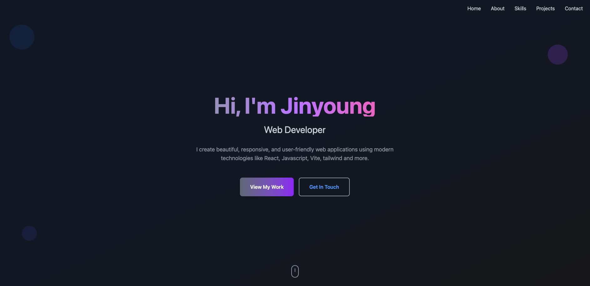

🧑‍💻 Personal Portfolio Website
📌 Overview

This is my personal portfolio website built with React and deployed on Firebase.
It showcases my projects, skills, and experience as a web developer.
The website is designed to be simple, responsive, and user-friendly.

🚀 Features

💼 Projects Section – Displays my main web development projects with live demos and GitHub links.

🧠 Tech Stack Section – Highlights the technologies I use (React, TypeScript, Firebase, Node.js, etc.).

📄 About Me Section – Introduces who I am and what I love to build.

🌐 Contact Section – Links to my GitHub, LinkedIn, and other social profiles.

📱 Responsive Design – Works perfectly on both desktop and mobile.

🛠️ Tech Stack

Frontend: React, javascript, Vite, Tailwind CSS

Hosting: Firebase

Version Control: Git & GitHub

## 🌐 Live Demo

👉 https://portfolio-jinyoung.web.app/

## 💻 GitHub Repository

👉 https://github.com/jinyoungpark106/portfolio

📷 Preview

